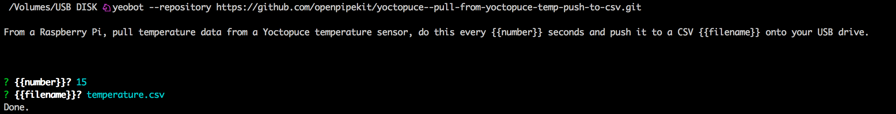

# Yeobot - The robot generator

Yeobot is the command line interface for generating robots from robot templates (Recipes). These aren't Star Wars episode 1 robots, these aren't Evil Empire robots, they're scrappy Rebel Alliance robots.

## Example

Now plug that USB Drive into a Pirateship Pi along with a Yoctopuce Temperature sensor and you'll find your USB Drive filling up with data.

## Install
Make sure you have Node.js installed, that will give the `npm` command.  Then run `npm install -g yeobot`.

